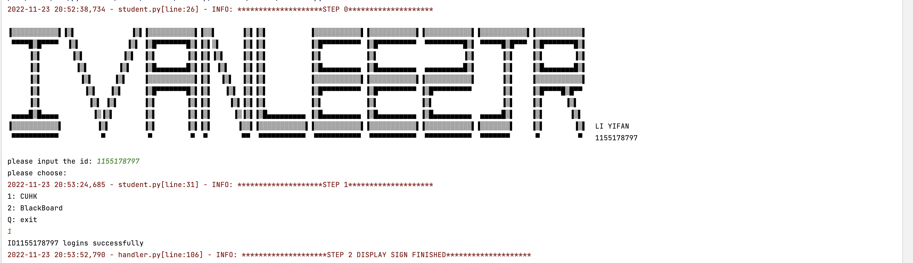

# HOW TO RUN

1. You can change the CUHK port and BLACKBOARD port in the `config.settings.py`, both `server or client/config/settings.py`. By default I used these two port numbers.

   ```python
   CUHKport = 8011
   BBport = 8002
   ```

2. The three py files required by the file are stored in `IEMS5710/client/student.py` , `IEMS5710/server/cuhk.py` and `IEMS5710/server/blackboard.py`. When you have run the server side and client side, There is a check here to verify whether you have a certificate issued by CUHK. If not, you must first visit CUHK, and then visit BLACKBORARD.


2. Hence, you have to choose **1** to choose CUHK. When you log in CUHK server, please you enter the key, which is used to generate CA private key, defined `regina`.(It may seem a bit redundant to input, thanks to the teaching assistant)

   

3. I have put every label in the logging info, so it will provide a more clear process effect. Then blackboard server is available. You can go back to `student.py` to choose again.

   

   As you can see, step4-6 will automatically run, including cert_verification, generating MAC and encrypting message, as well as sending message. 

4. If you want to terminate the program, at the last you can choose **q** and the code will automatically send this command. The server will recognize that this is a command to close the connection, and then it will automatically disconnect


So, the complete process is as follows:

- *A*. start three py file

- *B*. input sid in `student.py` and then choose **1**

  


- *C*. In the `CUHK.py`, please input the key **regina** to issue the certificate.

  

- *D*. back to `student.py` to choose **2**

  

  Then `blackboard.py` will finish all the left steps.

  

- *E*. Now, you have finished the first student and back to `student.py` to choose **q** to continue the next one.

  Please repeat step B to D and quit the server in the end.

  

# PACKAGE REQUIREMENTS

> 1. **logging** : output the result and content of every step
> 2. **struct** : Convert Python data to a string according to the specified format,the string is a byte stream. Convert the byte stream to the data type specified by Python according to the specified format;
> 3. **socket** : Used to provide connection-oriented, reliable data transmission services
> 3. **select** : Notifies the process that executed select() which Socket or file is readable or writable. Mainly used in Socket communication
> 3. **getpass** : The module provides a platform-independent way to enter passwords on the command line
> 3. **cryptography** :  Encrypt and decrypt strings using cryptography Encryption code
> 3. **datetime** : usage time
