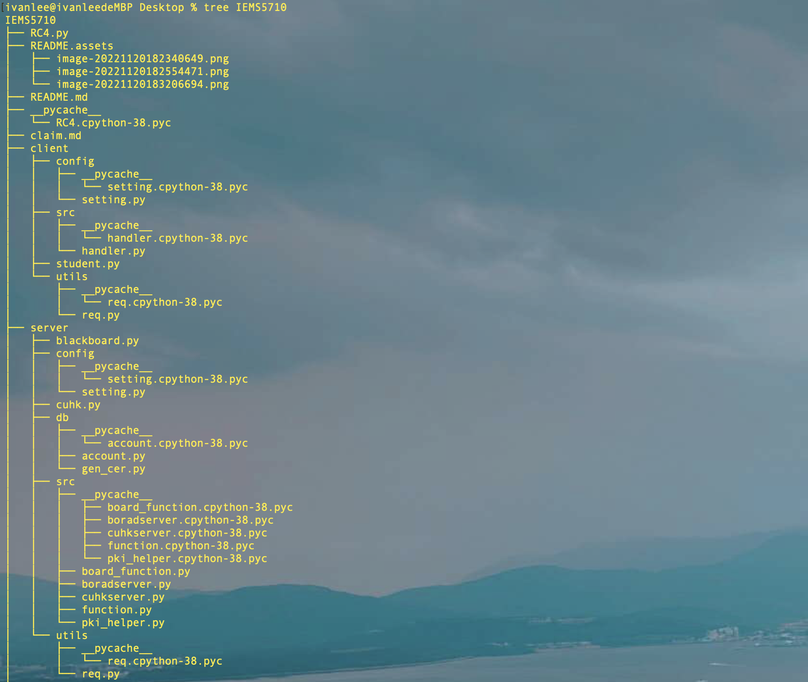

This is my GitHub account: [Regina's_IVANLEE](https://github.com/Ivan990717/IEMS5710)

This is my cnblog account: [ivanlee717](https://www.cnblogs.com/ivanlee717/)

# 1. code structure



As we can see in the picture, due to the huge amount of code, I first separated the server and client. Separately, I divided the codes in each side into different directories according to the functions, main files, and configuration information. The main students, CUHK, blackboard three files are in the most prominent position, and the amount of code in the file is very small.I use the student file as an example.

```python
'''
designed by ivanlee
'''
import time

from client.src.handler import Handler
import logging
logging.basicConfig(level=logging.DEBUG,
                    format='%(asctime)s - %(filename)s[line:%(lineno)d] - %(levelname)s: %(message)s')  # logging.basicConfig
# function configures the output format and method of the log


if __name__ == "__main__":
    stu = []
    logging.info('*'*20 + "STEP 0" + '*'*20)
    time.sleep(0.2)
    for i in range(3):

        stu.append(input("please input the id: "))
    logging.info('*' * 20 + "STEP 1" + '*' * 20)
    handler = Handler()
    handler.run(stu)
```

# 2. socket

We use the socket framework as a whole to complete the communication process between the two parties, and at the very beginning, the function of the server socket can complete the concurrent operations of multiple clients.

**Here is a reference to one of my own designs in [github](https://github.com/Ivan990717/python_fullstack)**

```python
    def run_server(self,Verifyboard):
        logging.info('*' * 20 + "STEP 1" + '*' * 20)
        server_object = socket.socket(socket.AF_INET, socket.SOCK_STREAM)
        server_object.setsockopt(socket.SOL_SOCKET, socket.SO_REUSEADDR, 1)

        server_object.setblocking(True)
        server_object.bind((self.host, self.port))
        server_object.listen(5)
        self.socket_object_list.append(server_object)

        while True:
            r, w, e = select.select(self.socket_object_list, [], [], 0.05)
            for sock in r:
                
                if sock == server_object:
                    conn, addr = server_object.accept()
                    self.socket_object_list.append(conn)
                  
                    self.conn_handler_map[conn] = Verifyboard(conn)
                    logging.info('new connection is coming')
                    continue
               
                handler_object = self.conn_handler_map[sock]
                # print(handler_object)

                result = handler_object.execute_()
                if not result:
                    self.socket_object_list.remove(sock)
                    del self.conn_handler_map[sock]
                sock.close()
```

At the beginning, I set up a list and dictionary to store all access endpoint containers, and used select, while and for loops to wait for client access for a long time.

# 3. Send and receive data

When sending and receiving data, I introduced a very detailed rule: In order to ensure the integrity of what we receive, introduce a struct package when sending data, first encapsulate a data header and send a fixed byte length of information to indicate the information received next length. This part is also refered to my previous work.

```python
def send_data(conn,text):
    data = text.encode('utf-8')
    header = struct.pack('i', len(data))
    conn.sendall(header)
    conn.sendall(data)
    
def recv_data(conn,chunk_size = 1024):
    has_read_size = 0
    bytes_list = []
    while has_read_size < 4:
        chunk = conn.recv(4 - has_read_size)
        has_read_size += len(chunk)
        bytes_list.append(chunk)
    header = b"".join(bytes_list)
    data_length = struct.unpack('i', header)[0]

   
    data_list = []
    has_read_data_size = 0
    while has_read_data_size < data_length:
        size = chunk_size if (data_length - has_read_data_size) > chunk_size else data_length - has_read_data_size
        chunk = conn.recv(size)
        data_list.append(chunk)
        has_read_data_size += len(chunk)

    data = b"".join(data_list)

    return data

```

In addition, in order to transfer the certificate file, I also wrote a function to transfer the file and receive the file.

```python
def recv_save_file(conn,save_path,chunk_size =1024):
    
    has_read_size = 0
    bytes_list = []
    while has_read_size < 4:
        chunk = conn.recv(4 - has_read_size)
        bytes_list.append(chunk)
        has_read_size += len(chunk)
    header = b"".join(bytes_list)
    data_length = struct.unpack('i', header)[0]
    file_object = open(save_path, mode='wb')
    has_read_data_size = 0
    while has_read_data_size < data_length:
        size = chunk_size if (data_length - has_read_data_size) > chunk_size else data_length - has_read_data_size
        chunk = conn.recv(size)
        file_object.write(chunk)
        file_object.flush()
        has_read_data_size += len(chunk)
    file_object.close()
def send_file_BySeek(conn, file_size, file_path, seek=0):
    header = struct.pack('i', file_size)
    conn.sendall(header)
    has_send_size = 0
    file_object = open(file_path, mode='rb')
    if seek:
        file_object.seek(seek)
    while has_send_size < file_size:
        chunk = file_object.read(2048)
        conn.sendall(chunk)
        has_send_size += len(chunk)
    file_object.close()
```

# 4. generate certificate

Here I use the package cryptography that comes with python to complete the functions of simulating the server as a CA, generating private keys, certificates, processing CSR requests, and issuing public keys for certificates.

During this semester, I also learned a lot of related content by myself, and summarized the relevant codes in my blog for reference. [Python_CSR](https://www.cnblogs.com/ivanlee717/p/16859513.html)

# 5. Encrypt the session key

RC4 (also known as Rivest Cipher 4) is a form of stream cipher that operates on a stream of data byte-by-byte. RC4 stream cipher is one of the most widely used stream ciphers, it encrypts messages one byte at a time through an algorithm, is simple and fast to operate.

RC4 is a technical means of encryption in the field of electronic information, used in wireless communication networks, is an electronic cipher, using 64-bit or 128-bit key size. It is commonly used in applications such as Secure Sockets Layer (SSL), Transport Layer Security (TLS), and is also used in the IEEE 802.11 wireless LAN standard.

In the process of encrypting the session key on the server, I used the RC4 algorithm for encryption. The last algorithm code is also derived from a file in my github, followed by my github [link](https://github.com/Ivan990717/cryptology/tree/main/%E5%AF%86%E7%A0%81%E5%AD%A6).

```python
    def generate_session_key(self,conn,id):
        logging.info('*' * 20 + "STEP 4 GENERATE SESSION_KEY" + '*' * 20)
        time.sleep(0.2)
        '''
        the default key is same as the CA root private key:
        regina
        we will use a key to encrypt the regina and then send to client
        encryption method is RC4
        '''
        from RC4 import RC4Encrypt
        cipher_key = RC4Encrypt("regina",id*2)
        # print(cipher_key)
        req.send_data(conn,cipher_key)
        logging.info('session_key has been generated')
        return cipher_key
```


